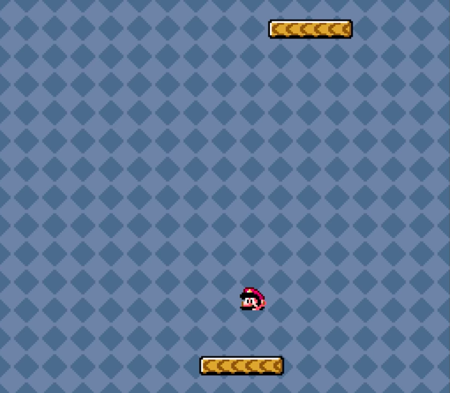
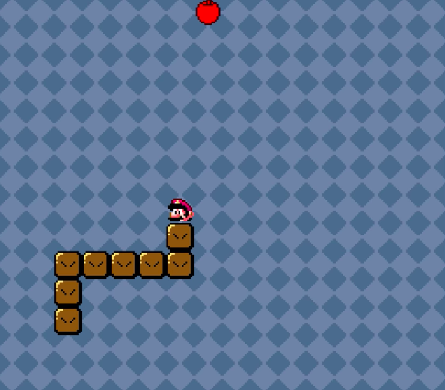
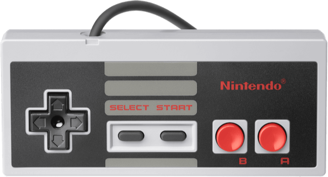

*This project was done for between the end of my last TLS-SEC semester and the
beginning of my final year internship. We were in pairs and had to choose our
subject. We chose to work on code injection in video game via the game commands
themselves.*

*The full report, unfortunately only available in French (but could be machine
translated) and written with a very playful, student-like tone, can be
[downloaded here](rapport.pdf).*

## Abstract

During this project, we tried to answer the question: \"can you inject code and
take control of the execution of a video game just by using its gameplay
elements?\". The answer is \"yes\" and along the journey, we discovered the
whole universe of tool-assisted speedrun[^1] and its community. From [manually
injecting Flappy Bird](https://www.youtube.com/watch?v=hB6eY73sLV0) into Super
Mario World to [doing a Skype
communication](https://arstechnica.com/gaming/2017/01/how-a-robot-got-super-mario-64-and-portal-running-on-an-snes/)
via Zelda on a Super Nintendo Entertainment System, the range of possibilities
is incredible.

## Introduction

Code injection is usually about C buffer overflow, or SQL commands injection,
but in our project, it was about hijacking the execution in a video game. We
discovered many games that present known bugs that can be exploited to take
control of the execution. We firstly focus our intention on Super Mario World,
where some speedrunners achieved to [finish the game](http://tasvideos.org/3957S.html) via the injection of a
one-line instruction, and some others
achieved to [inject enough code](http://tasvideos.org/4156S.html) to play an injected Pong and
Snake (see the following figures) along with
finishing the game super early.

 | 
:-----------------------------------: | :-------------------------------------:
Mario pong                            | Mario snake

If you watch the videos of the speedruns in question, you will wonder how a
human can perform such an impressive series of inputs. For some, a human just
can't because of the speed and the precision of the execution: this is a
tool-assisted speedrun. It is an activity where you are allowed to design, via
the tools of an emulator[^2], a \"perfect\" run that will be performed by
executing an exact list of inputs for each frame of the game (see [this
tutorial](http://tasvideos.org/TASTutorial.html)).

We finally decided to choose Super Mario Bros 3 because of its bug named
[\"Wrong warp\"](https://www.youtube.com/watch?v=fxZuzos7Auk). This bug was
exploited like the one discovered in Super Mario World, first, someone used it
to [jump directly to the end scene](http://tasvideos.org/4288S.html) of the
game, and someone else achieved to [take total
control](http://tasvideos.org/4961S.html) of the game.

## Related work

Related work is mostly available on <http://tasvideos.org> which is the website
of the community of tool-assisted speedruns. The case of code injection we
mostly studied and try to understand deeply was the [total
control](http://tasvideos.org/4961S.html) speedruns by Lord Tom and Toompa
(2014). The amount of work is impressive considering all the limitations and
difficulties we discovered.

## Details

The first difficulty when you want to execute arbitrary code on a computer is
to take control of the program counter. This is a value, often stored in a
register, that indicates which instruction to execute next. In Super Mario Bros
3, the entry point of our exploitation was a bug, named \"Wrong warp\": this
bug makes it possible for Mario to access a zone of the game which is not
supposed to be accessible and present a very buggy map. Especially, bouncing on
an invisible note block in this zone crashes the game.

But, what does it mean to \"crash the game\"? In our situation, bouncing on
that block will call some subroutines in the code that were not supposed to be
called in that manner and will return twice on an unprepared stack. It will
then underflow the stack (because not enough stuff was pushed on it) and reach
the top of this stack, where a special value is stored. Why store stuff on top
of the stack? Because the stack is not supposed to ever be that full and memory
space is scarce! This special value indicates if the level is vertical or
horizontal, and in our case, the level is vertical, so the value is `0x0080`
and will be treated by the computer as a pointer to the function where to
return.  But in this address range of the console, this is the CPU RAM that is
mapped! So to summarize, via this bug, we shifted the program counter from a
memory zone where code is placed to the RAM of the console were some crucial
values are stored but not code at all. So why does it crash? Because the CPU
tries to interpret some data that translate to random code or worse, invalid
code, that leads to the interruption of the execution.

So we achieved to hijack the program counter to the address `0x0080` in the CPU
RAM and the game crashes. How can we use that situation to our advantage? It
happens that every game maps the NES 2KB RAM in their manner and some people
reverse engineered the values to their semantic for some games (for Super Mario
Bros 3, you can find it
[here](https://datacrystal.romhacking.net/wiki/Super_Mario_Bros._3:RAM_map)).
And it just happens that addresses range `0x0091`-`0x0096` and
`0x009A`-`0x009E` can be manipulated by the player in-game. These first 5 bytes
store enemies horizontal position on screen and the next 5, their number of
steps.

To recap, we have a vulnerability in the game that makes it possible to execute
a memory zone where the player can freely affect the values stored. We have
everything to execute arbitrary code, but it must be very succinct, as stated
in the previous paragraph, it must fit in around 10 bytes. Instruction in
[6502](https://www.masswerk.at/6502/6502_instruction_set.html), the instruction
set of the NES, can be 1, 2 or 3 bytes long. So we can already write a 5 lines
program which is enough to enable us to write longer programs!

```.asm
$0091: JSR $96E5 ; subroutine that waits until frame ends; NMI updates controllers & $15 counter
$0094: LDA $F7   ; load controller 1 state
$0096: BRK       ; do nothing
$0098: BRK       ; do nothing
$009a: INX       ; increment X register
$009b: STA,X $7d ; store controller data to next spot in RAM
$009d: BNE $0091 ; if X isn't zero, loop to $0091
```

The program that we will write with the 10 bytes is a loop that reads the 8
buttons controller inputs which are coded on a byte and write that just after
in the RAM. This way, with the right sequence of inputs, we can write any
instructions, we just needed a little tool, named
[byteToNES](https://github.com/mtardy/bytesToNES), which we wrote in Python that
translate bytes to NES controller inputs string.  But we still have a
limitation, the Super Mario Bros 3 controller driver forbid to have pressed
simultaneously left-right or down-up because it must not be possible on a
working controller. So the first thing we have to do is to rewrite a more
tolerant driver with the available instructions and then we are free to write
anything we want!

<p align="center">
  
</p>

## Acknowledgments

I would like to thank our TLS-SEC professors, during these pandemic times, they
achieved to teach us sophisticated material about software vulnerabilities and
system architecture. Special thanks to Stephane Duverger who, by teaching us
the x86 architecture, made it easy to understand a simple machine like the NES.
And special thanks to Benoit Morgan that inspired us on the subject with his
passion and knowledge for whatever he talks about.

## Conclusion

It's interesting the number of coincidences it requires for this bug to lead to
a big vulnerability: so many planets aligned! We must remind that these games
were not programmed considering the security. In the '80s, programmers mostly
tried to create the best game with little memory and computing power at their
disposal and tried to avoid bugs because they can impact the gaming experience.
But even with the famous Nintendo's seal of quality, we can still find some
errors that make it possible to do some very fun stuff on these forty years old
games and consoles.

## Bibliography

-  S. Bling. (2016). “Snes code injection - flappy bird in smw” Available:
https://www.youtube.com/watch?v=hB6eY73sLV0.

-  K.  Orland. (2017).  “How  a  robot  gotsuper mario 64 and portal
“running” onan snes” Available:
https://arstechnica.com/gaming/2017/01/how-a-robot-got-super-mario-64-and-portal-running-on-an-snes/.

-  Wikipedia. (2018). “Tasbot” Available:
https://en.wikipedia.org/wiki/TASBot.

-  J. N. Masterjun. (2013). “Masterjun’s snessuper mario world ’glitched’ in
01:39.74” Available: http://tasvideos.org/3957S.html.

-  J. N. Masterjun. (2014). “Masterjun’s snes supermario world ’arbitrary
code execution’ in 02:25.19” Available: http://tasvideos.org/4156S.html.

-  S. Agnew. (2020). “How to write luascripts for video games with the
bizhawk emulator” Available:
https://www.twilio.com/blog/how-to-write-lua-scripts-for-video-games-with-the-bizhawk-emulator.

-  adelikat. (2012). “How to make a tool assisted speedrun” Available:
   http://tasvideos.org/TASTutorial.html.

-  R. G. M. Explained. (2016). “Super mario bros. 3 - wrong warp” Available:
   https://www.youtube.com/watch?v=fxZuzos7Auk.

-  L. Tom and Tompa. (2014). “Lord tomand tompa’s nes super mario bros. 3 in
   02:54.98” Available: http://tasvideos.org/4288S.html.

-  L. Tom. (2016). “Lord tom’s nes supermario bros. 3 ’total control’ in
   08:16.23” Available: http://tasvideos.org/4961S.html.

-  Datacrystal. (2018). “Super mario bros.3:ram map” Available:
   https://datacrystal.romhacking.net/wiki/Super_Mario_Bros._3:RAM_map.

-  N. Landsteiner. (2015). “6502 instructionset” Available:
   https://www.masswerk.at/6502/6502_instruction_set.html.

-  M. Tardy. (2021). “ByteToNES” Available:
   https://github.com/mtardy/bytesToNES.

[^1]: Speedrun is the activity of finishing a game as quickly as
    possible. Tool-assisted speedrun allows the use of various software
    tools to create the perfect run to be executed by a computer.

[^2]: An emulator is a software that emulates the console to let you
    play games designed for its architecture and let you see its
    internal state (RAM, execution, inputs\...).
