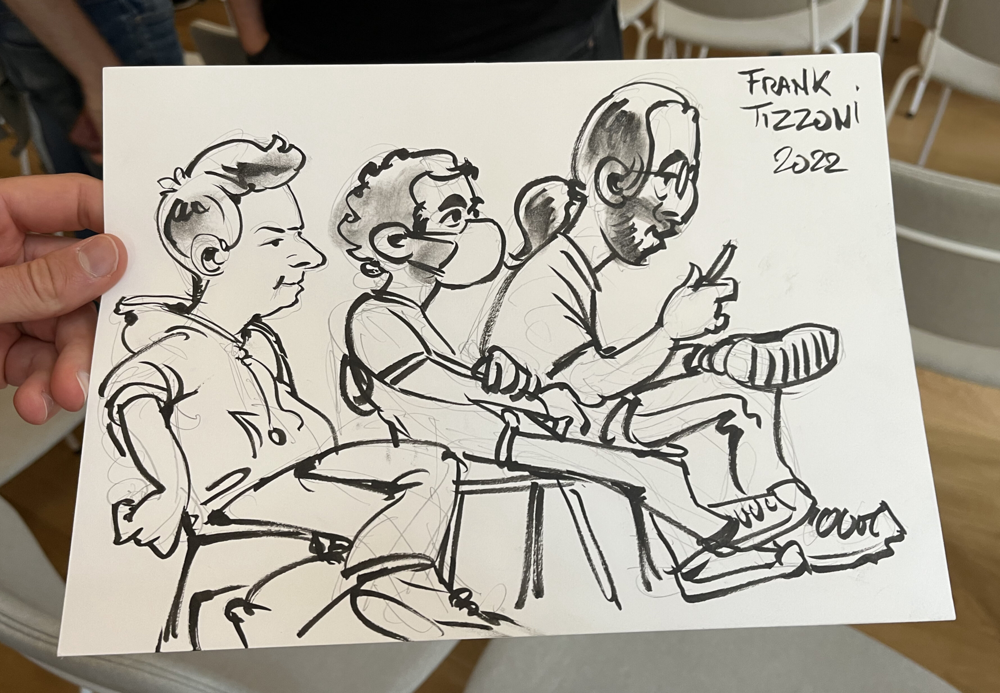

During the last three months, I had the opportunity to go to multiple events.
First, a proposal I submitted to Black Hat Asia Arsenal was accepted to
present [*kdigger*](https://github.com/quarkslab/kdigger), a Kubernetes
security tool. Then I had the chance to go to the KubeCon Europe to meet the
people with whom I interacted in the project. And finally, I got the last few
tickets for a kernel developer conference in Paris, Kernel Recipes.

I mainly wanted to talk about these three events, but aside, I also presented,
in the context of my work, at my company annual event, [Quarks In The Shell
(QITS)](https://content.quarkslab.com/event-quarks-in-the-shell) on the 7th of
April and at the ["Forum International de la Cybersécurité"
(FIC)](https://www.forum-fic.com/en/home/) on the 8th of June, as its name, in
French, does (not) indicate, is more a French event that an international one.
The first event in April was a great and fun opportunity to train in front of
my colleagues and the company customers in preparation for the Black Hat event.
It went pretty well and I was proposed to redo that presentation at the FIC.

Here is the timeline of the events with their starting dates:
```goat
  .------. .---------. .---------. .----------------. .-----.
--+ qits +-+ bh asia +-+ kubecon +-+ kernel recipes +-+ fic +--
  '------' '---------' '---------' '----------------' '-----'
   ^        ^           ^           ^                  ^
   |        |           |           |                  |
   |07/04   |12/05      |16/05      |01/06             |08/06
```

---

## Black Hat Asia

Black Hat Asia was taking place in Singapore, in the Marina Bay Sands Convention
Center, which is a huge building near the iconic hotel. It's the largest "flat"
building on the left, behind the hotel, on the picture below.



First of all, I never went to Singapore nor Asia before so it was an amazing
opportunity! I went alone with no colleagues but I had the extreme luck that my
ex-colleagues just opened new offices in Singapore and happened to be in the
city at the exact same time. So from a personal and discovery perspective, it
was crazy, I visited almost all I wanted to see and had food and drinks in
fantastic places with friends!

### The event

Now for the conference in itself, it was a two-day event where I had three
slots of presentation, [two in-person and one
virtually](https://www.blackhat.com/asia-22/arsenal/schedule/#kdigger-a-context-discovery-tool-for-kubernetes-penetration-testing-26238).
There were not as many people as I thought, it looked more like an event with
hundreds of people than thousands. Covid lockdowns in China might have had an
effect on the attendance, all Chinese presenters were presenting virtually.

I met a few people there, and I observed that the number of French people attending
this conference was impressive. Apart from that, I met the author of
[*kubesploit*](https://github.com/cyberark/kubesploit), that was [also
presenting at
Arsenal](https://www.blackhat.com/asia-22/arsenal/schedule/index.html#kubesploit-a-post-exploitation-framework-focused-on-containerized-environments-25909).
I learned that he was also the author of the fabulous
[*kubeletctl*](https://github.com/cyberark/kubeletctl) and many others tools.
For the anecdote, although it was cool to finally meet someone who didn't speak
French, one of his nationalities was French! I also met someone that was kind
enough to answer my bottle to the sea on Twitter (notice the Singap**our**
:fr:), he was [also presenting at
Arsenal](https://www.blackhat.com/asia-22/arsenal/schedule/index.html#pwnppeteer---phishing-post-exploiautomation-at-scale-26191):



### Presentations

Some of my colleagues warned me about presenting at Arsenal because it's in the
noisy Business Hall, and sometimes without a lot of visitors. But I had a great
experience, all presenters had a microphone and many groups attended the small
presentations. I even met persons that admitted that Arsenal was their favorite
activity in Black Hat. I think I did my demonstration around four or five times
and had a few talks about Kubernetes security with some members of the
audience.

For the briefings, I cannot link videos because they are not yet online but
this is a selection of the cool presentations I saw.

#### Remote Memory-Deduplication Attacks - Eric Kraft, Daniel Gruss, Martin Schwarzl

Introduction of a side-channel attack to read memory that could even be
exploited over the Internet. The presenters were a professor and his student
and they give an amusing presentation on top of the great technical content.

[Link to the schedule](https://www.blackhat.com/asia-22/briefings/schedule/index.html#remote-memory-deduplication-attacks-26068)

#### DroidGuard: A Deep Dive into SafetyNet - Romain Thomas

A great deep dive into the process of reversing Google SafetyNet, a mechanism
to verify devices' integrity.

[Link to the schedule](https://www.blackhat.com/asia-22/briefings/schedule/index.html#droidguard-a-deep-dive-into-safetynet-25835)

#### Like Lightning From the Cloud: Finding RCEs in an Embedded TLS Library and Toasting a Popular Cloud-connected UPS - Yuval Sarel, Gal Levy

A technical talk on finding vulnerabilities in TLS libraries that literally
ended in burning a UPS on stage:



[Link to the schedule](https://www.blackhat.com/asia-22/briefings/schedule/index.html#like-lightning-from-the-cloud-finding-rces-in-an-embedded-tls-library-and-toasting-a-popular-cloud-connected-ups-25927)

#### macOS Vulnerabilities Hiding in Plain Sight - Csaba Fitzl

An explanation of three vulnerabilities found in macOS by the speaker. It was
particularly interesting because the presenter explained that his favorite way
of finding vulnerabilities was searching around already discovered
vulnerabilities, reading the write-ups dozens of times. I can't agree more on
this strategy, vulnerabilities tend to cluster.

[Link to the schedule](https://www.blackhat.com/asia-22/briefings/schedule/index.html#macos-vulnerabilities-hiding-in-plain-sight-26073)

---

## KubeCon Europe

I stayed less than 24 hours in Paris and headed to València for the KubeCon.



### Contributor Summit

I had the chance to participate in the Contributor Summit since [I became an
organization member](https://github.com/kubernetes/org/commit/20a0ba805ce615291fc62eb7d453b33cd28f9852)
just before, early May. It was a great place to meet some people I had seen at
contributors’ meetings and I also became more familiar with some people in the
SIG docs.



### Cloud-Native Security Day CTF

Unfortunately, it was a bit too expensive for my company to pay for the main
ticket plus the security co-located event so I could not attend the
presentation but I tried to participate in the CTF organized by Control Plane.
They were running low on clusters for participants but I had the chance to find
someone kind enough, working at [the Paranoids](https://www.yahooinc.com/technology/paranoids/),
to share their cluster and even team up for the most difficult steps.

As usual, the CTF gave me some ideas that were added to
[*kdigger*](https://github.com/quarkslab/kdigger/blob/master/CHANGELOG.md#120---2022-06-16).

### Presentations

Here is a selection of the presentation I really enjoyed during the KubeCon.
Please note that it's the best of what I saw in person, I did not browse the
other presentations afterwards online yet, and I know that I missed some gems.

#### Seeing is Believing: Debugging with Ephemeral Containers - Aaron Alpar, Kasten

After discovering the Business Hall and meeting a few people, it was my first
presentation, and I was happily surprised by the quality of it! It was an
introduction to the ephemeral containers feature, with the associated `kubectl
debug` command.



#### Trampoline Pods: Node to Admin PrivEsc Built Into Popular K8s Platforms - Yuval Avrahami & Shaul Ben Hai

Before that, I had lunch with some of the [chainguard](https://www.chainguard.dev/)
co-founders by accident and then I went to my first security talk. The speaker
defined a new term, "Trampoline Pods", for pods that could be used for
privilege escalation. The presentation was great, looking into the components
of famous projects that were often given too many privileges.



#### How Attackers Use Exposed Prometheus Server to Exploit Kubernetes Clusters -  David de Torres Huerta & Miguel Hernández

It was impressive to see how much data can leak Prometheus of clusters,
especially when it's exposed on the Internet. It can be useful to see if any
software is vulnerable to 1-days in clusters.



#### The Hitchhiker's Guide to Pod Security - Lachlan Evenson, Microsoft

This presentation was basically the Kubernetes blog post [Kubernetes 1.23: Pod
Security Graduates to Beta](https://kubernetes.io/blog/2021/12/09/pod-security-admission-beta/)
presented live by one of its co-authors, Lachlan Evenson. It was truly one of my
favorite talks of the KubeCon because Lachlan was one of the best speakers I saw.
The presentation was funny and the content was perfect as an introduction to
this new admission controller.



#### Keynote: Securing Shopify's Software Supply Chain - Shane Lawrence, Shopify

Great introduction to the software supply chain issue during the keynotes!




#### Keynote: Building Bridges: Cloud Native and High Performance Computing - Ricardo Rocha

It was great to hear about CERN infrastructure during the keynotes. The scale is crazy!



#### The Soul of a New Command: Adding ‘Events’ to kubectl - Bryan Boreham, Grafana Labs

One of my favorite presentations of this KubeCon! It was a technical deep dive
on how to add a command to *kubectl* and why making the event sorted from
`kubectl events` was way harder than you might think. I liked that it was a
talk on the adventure of solving an issue.



#### Threat Modelling Kubernetes: A Lightspeed Introduction - Lewis Denham-Parry, Control Plane

A nice presentation on threat modelling on Kubernetes that was a good summary
of the good questions you can ask yourself when trying to protect a cluster.



#### SIG Security Update: We Lift Together - Tabitha Sable, Pushkar Joglekar, Rey Lejano, Savitha Raghunathan

To finish, the best SIG updates by some of the greatest people in the
Kubernetes community!



---

## Kernel Recipes

I rested a bit after the KubeCon in Spain and finally succeeded to get some
tickets for [Kernel Recipes](https://kernel-recipes.org/en/2022/), a Linux
kernel developer conference in Paris. It was very different from Black Hat or
the KubeCon because it was super small, around a hundred people, and not
very far from where I lived.

I discovered the venue, in the [cité internationale
universitaire](https://www.ciup.fr/en/), a unique place in Paris, a big green
campus near a garden with the houses of 43 countries, with their own
architectural style.



### Presentations

All talks were recorded and are available on Youtube, most of them aren't
available as extracts yet, but the whole livestreams of
[day 1](https://www.youtube.com/watch?v=v--rVT4RsCE),
[day 2](https://www.youtube.com/watch?v=nhJqaZT94z0),
and [day 3](https://www.youtube.com/watch?v=ELPENQrtUas)
are online. A live blog was written during the presentations that contains
way more information than my notes. The live blog is the articles from June 1
to 3 on the [Kernel Recipes blog](https://kernel-recipes.org/en/2022/blog/).

Here is a selection of my favorite talks during the event. Click on the
drawings by Frank Tizzoni to see more information about the presentation, you
can find the slides and maybe the associated videos in the future.

#### Ftrace update - Steven Rostedt

Steven introduced relatively new features of *ftrace* that might not be well
known. It was really entertaining and enjoyable to watch!



#### Trust and the Linux development model - Greg KH

Good talk on the University of Minnesota hypocrite commits and the kernel
development security. I only heard of this history and never had the details,
it was nice to learn from the person that mostly handled the case.



#### Once upon an API - Michael Kerrisk

A presenter could not attend and we had the chance to have Michael Kerrisk that
was ready to present a fantastic story about Linux interfaces. He detailed how
`prctl(2)` interface is inconsistent and how it led to a complete mess.



#### The untold story of BPF - Alexei Starovoitov

Alexei told the birth story of eBPF. It was super interesting because on top of
giving the reasons why eBPF was introduced to the kernel, it was a talk on how
to merge large chunks into the kernel and become trusted in the Linux community.



#### Many other great presentations

- [Make Linux developers fix your kernel bug](https://kernel-recipes.org/en/2022/talks/make-linux-developers-fix-your-kernel-bug/)
- [Idmapped Mounts](https://kernel-recipes.org/en/2022/talks/idmapped-mounts/)
- [Rethinking the kernel camera framework](https://kernel-recipes.org/en/2022/talks/rethinking-the-kernel-camera-framework/)
- [The Kernel Self-Protection Project and how you can help](https://kernel-recipes.org/en/2022/talks/the-kernel-self-protection-project-and-how-you-can-help/)
- [Developing Tilck, a Tiny Linux-compatible kernel](https://kernel-recipes.org/en/2022/talks/developing-tilck-a-tiny-linux-compatible-kernel/)
- [HID-BPF](https://kernel-recipes.org/en/2022/talks/hid-bpf/)
- [New userspace api for display panel brightness-control](https://kernel-recipes.org/en/2022/talks/new-userspace-api-for-display-panel-brightness-control/)

### My takes on Kernel Recipes

I loved this event, it was completely different from what I experienced with
Black Hat or the KubeCon. It was like discovering an established universe, and
I saw a lot of well-known persons in the ecosystem, from whom I read the book
or just knew the name. On top of that, I was super happy to meet some people working
at Isovalent and was accidentally drawn with them watching the last
presentations!



---

## Conclusion on these adventures

I was very lucky to participate in these different events that made me discover
the reality of these very different communities. The link between all these
experiences was open source and it motivated me to spend more time contributing
to projects. Meeting some of the Kubernetes people was also very cool.

I was overall impressed with the presentation skills of some speakers and I
will try to take inspiration from them for my future presentations. On that
topic, I will again present *kdigger* at [Pass The
Salt](https://cfp.pass-the-salt.org/pts2022/talk/EQ8QFD/), a security and libre
conference, in Lille, France, next week!
