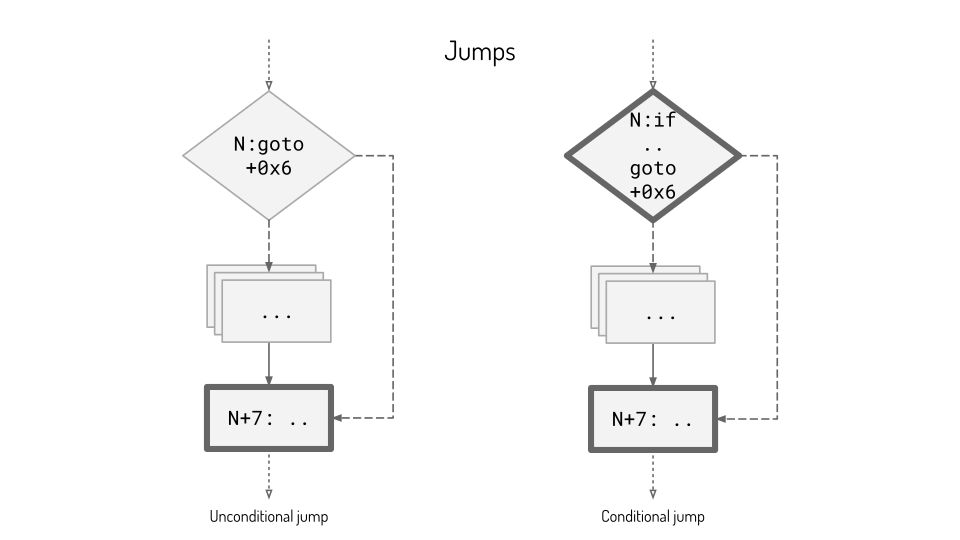
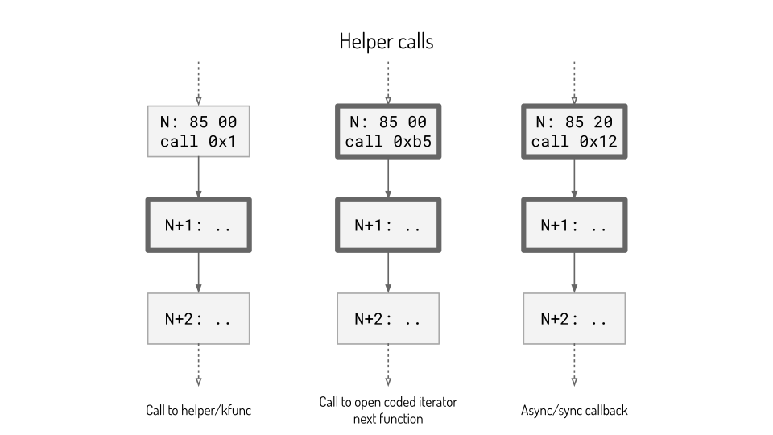
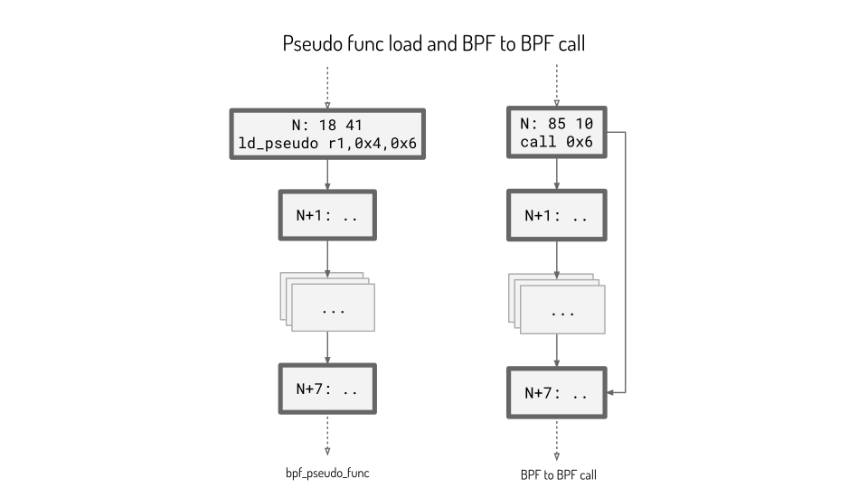

*This article is part of a series of notes that Paul Chaignon and I wrote to prepare a
presentation introducing the BPF verifier state pruning for Linux Plumbers 2025
in Tokyo, see [Making Sense of State Pruning](https://lpc.events/event/19/contributions/2162/).
You can also find the [slides](https://lpc.events/event/19/contributions/2162/attachments/1820/3904/LPC25_State_Pruning.pdf)
and the [video recording](http://www.youtube.com/watch?v=EoEBkFJ3St4) of the
presentation.*

*The version of the kernel code for these notes is `v6.17`.*

## Why do we care about prune points?

The entry point of the state pruning logic in the BPF verifier resides in the
`do_check` function going over each instruction. Early in that function, the
state pruning logic is triggered via the `is_state_visited` function and
guarded by `is_prune_point`.

```c
if (is_prune_point(env, env->insn_idx)) {
	err = is_state_visited(env, env->insn_idx);
	if (err < 0)
		return err;
	if (err == 1) {
		/* found equivalent state, can prune the search */
		if (env->log.level & BPF_LOG_LEVEL) {
			if (do_print_state)
				verbose(env, "\nfrom %d to %d%s: safe\n",
					env->prev_insn_idx, env->insn_idx,
					env->cur_state->speculative ?
					" (speculative execution)" : "");
			else
				verbose(env, "%d: safe\n", env->insn_idx);
		}
		goto process_bpf_exit;
	}
}
```

It then seems important to understand what qualifies an instruction to be a
prune point since without it, the state pruning logic won't be triggered.


## What is a prune point?

As shown in the previous section, a prune points marks a BPF instruction on
which we will trigger the state pruning logic along the verification of the
program. The state pruning logic will be mainly responsible for saving new
states for later comparison, and shortcut the verification when we find an
equivalent state.

To start understanding how pruning points are accessed and written, let's see
how the code interacts with the `.prune_point` field:

```c
static void mark_prune_point(struct bpf_verifier_env *env, int idx)
{
	env->insn_aux_data[idx].prune_point = true;
}

static bool is_prune_point(struct bpf_verifier_env *env, int insn_idx)
{
	return env->insn_aux_data[insn_idx].prune_point;
}
```

The above code from the previous section in `do_check` is the only place
`is_prune_point` is called. On the other side, marking prune points is done
during the parsing of the instructions.

### Parsing the BPF program

The entry point of the BPF verifier is the `bpf_check` function, called from
the `bpf_prog_load` function in `syscall.c`, it runs the BPF verifier. From
there, the function that will parse the instructions is `check_cfg` (cfg for
for control flow graph), which is documented as "non-recursive
depth-first-search to detect loops in BPF program". This function will set the
very first instruction as 0, set the `cur_stack` to 1 and call `visit_insn`
inside a loop while `env->cfg.cur_stack > 0`.

```c
while (env->cfg.cur_stack > 0) {
	int t = insn_stack[env->cfg.cur_stack - 1];

	ret = visit_insn(t, env);
	switch (ret) {
	case DONE_EXPLORING:
		insn_state[t] = EXPLORED;
		env->cfg.cur_stack--;
		insn_postorder[env->cfg.cur_postorder++] = t;
		break;
	case KEEP_EXPLORING:
		break;
	default:
		if (ret > 0) {
			verifier_bug(env, "visit_insn internal bug");
			ret = -EFAULT;
		}
		goto err_free;
	}
}
```

### Deep dive into `visit_insn`

Let's understand how `visit_insn` explores the instructions. For that we'll
need to check how the
[instruction set is defined for v6.17](https://www.kernel.org/doc/html/v6.17/bpf/standardization/instruction-set.html).

First off, it checks if the instruction is `bpf_pseudo_func`, because it needs
to be treated differently and immediately call `visit_func_call_insn`. The
`bpf_pseudo_func` function checks that the opcode is `BPF_IMM | BPF_DW |
BPF_LD` and that the src is `0x4` which means that this is a load instruction
loading an address using the wide instruction encoding.

```c
if (bpf_pseudo_func(insn))
	return visit_func_call_insn(t, insns, env, true);
```

Let's remember that this function was called, as it will be called later on and
does contain marking of pruning points.

Next, all instruction classes different than `BPF_JMP` and `BPF_JMP32` are
treated. Those instructions are only `FALLTHROUGH` instructions for the CFG
analysis, indeed they cannot create branches in the execution.

```c
/* All non-branch instructions have a single fall-through edge. */
if (BPF_CLASS(insn->code) != BPF_JMP &&
    BPF_CLASS(insn->code) != BPF_JMP32) {
	insn_sz = bpf_is_ldimm64(insn) ? 2 : 1;
	return push_insn(t, t + insn_sz, FALLTHROUGH, env);
}
```

So now, only the [jump instructions](https://www.kernel.org/doc/html/v6.17/bpf/standardization/instruction-set.html#jump-instructions)
remain. First off the `BPF_EXIT` is taken care of with `DONE_EXPLORING`.

```c
switch (BPF_OP(insn->code)) {
case BPF_EXIT:
	return DONE_EXPLORING;
```

Then the more complexe case of `BPF_CALL` is treated. A call instruction can be:
- Calling a helper function by static ID, this is a typical helper call.
- Calling to program-local function using offset from PC, this is a bpf to bpf
  pseudo call.
- Calling to a helper function by BTF ID, this is a bpf pseudo kfunc call.

First off, we take care of the sync and async callback helpers/kfuncs, this is
a limited set of helpers. Here are examples on the helper side, for sync:
`bpf_for_each_map_elem`, `bpf_find_vma`, `bpf_loop`, or
`bpf_user_ringbug_drain`, and for async: `bpf_timer_set_callback`. In those two
cases, those are marked as prune points. The `mark_prune_point` is present 8
times in the code, so this is 2/8 for call sites.

```c
case BPF_CALL:
	if (is_async_callback_calling_insn(insn))
		/* Mark this call insn as a prune point to trigger
		 * is_state_visited() check before call itself is
		 * processed by __check_func_call(). Otherwise new
		 * async state will be pushed for further exploration.
		 */
		mark_prune_point(env, t);
	/* For functions that invoke callbacks it is not known how many times
	 * callback would be called. Verifier models callback calling functions
	 * by repeatedly visiting callback bodies and returning to origin call
	 * instruction.
	 * In order to stop such iteration verifier needs to identify when a
	 * state identical some state from a previous iteration is reached.
	 * Check below forces creation of checkpoint before callback calling
	 * instruction to allow search for such identical states.
	 */
	if (is_sync_callback_calling_insn(insn)) {
		mark_calls_callback(env, t);
		mark_force_checkpoint(env, t);
		mark_prune_point(env, t);
		mark_jmp_point(env, t);
	}
```

After that, we are checking if the call is a typical helper call. In this
situation we don't mark the instruction as prune point.

```c
	if (bpf_helper_call(insn)) {
		const struct bpf_func_proto *fp;

		ret = get_helper_proto(env, insn->imm, &fp);
		/* If called in a non-sleepable context program will be
		 * rejected anyway, so we should end up with precise
		 * sleepable marks on subprogs, except for dead code
		 * elimination.
		 */
		if (ret == 0 && fp->might_sleep)
			mark_subprog_might_sleep(env, t);
		if (bpf_helper_changes_pkt_data(insn->imm))
			mark_subprog_changes_pkt_data(env, t);
```

Then, we check if the call is a kfunc call.

```c
	} else if (insn->src_reg == BPF_PSEUDO_KFUNC_CALL) {
		struct bpf_kfunc_call_arg_meta meta;
```

Now we deal with [open coded iterators](https://docs.ebpf.io/linux/concepts/loops/#numeric-open-coded-iterators),
the next iterator functions are immediately marked as prune points (3/8).

```c
		ret = fetch_kfunc_meta(env, insn, &meta, NULL);
		if (ret == 0 && is_iter_next_kfunc(&meta)) {
			mark_prune_point(env, t);
			/* Checking and saving state checkpoints at iter_next() call
			 * is crucial for fast convergence of open-coded iterator loop
			 * logic, so we need to force it. If we don't do that,
			 * is_state_visited() might skip saving a checkpoint, causing
			 * unnecessarily long sequence of not checkpointed
			 * instructions and jumps, leading to exhaustion of jump
			 * history buffer, and potentially other undesired outcomes.
			 * It is expected that with correct open-coded iterators
			 * convergence will happen quickly, so we don't run a risk of
			 * exhausting memory.
			 */
			mark_force_checkpoint(env, t);
		}
		/* Same as helpers, if called in a non-sleepable context
		 * program will be rejected anyway, so we should end up
		 * with precise sleepable marks on subprogs, except for
		 * dead code elimination.
		 */
		if (ret == 0 && is_kfunc_sleepable(&meta))
			mark_subprog_might_sleep(env, t);
	}
```

Finally, we call `visit_func_call_insn`, the same function that we called at
the beginning of the `visit_insn` function for the wide encoded instruction.
We'll investigate after what happens in that function.
```c
	return visit_func_call_insn(t, insns, env, insn->src_reg == BPF_PSEUDO_CALL);
```

The next operation code is `BPF_JA` which is an unconditional jump, it has a
single "edge", that's why it's calling `push_insn` with `t + off + 1`. The
landing point of the jump is marked as a pruning point (4/8).

```c
case BPF_JA:
	if (BPF_SRC(insn->code) != BPF_K)
		return -EINVAL;

	if (BPF_CLASS(insn->code) == BPF_JMP)
		off = insn->off;
	else
		off = insn->imm;

	/* unconditional jump with single edge */
	ret = push_insn(t, t + off + 1, FALLTHROUGH, env);
	if (ret)
		return ret;

	mark_prune_point(env, t + off + 1);
	mark_jmp_point(env, t + off + 1);

	return ret;
```

Finally, we deal with all the rest with the `default:` case, looking at the
table, since we eliminated unconditional jumps and calls, we now only have
conditional jumps with two edges, meaning that we need to visit both
possibilities.

One of the prune point is marked at the base of the conditional jump
instruction (5/8) and then call `push_insn` two times, one time with `t + 1`
with the edge being `FALLTHROUGH`, and another time with the landing point `t +
off + 1` with the edge being `BRANCH`.
```c
default:
	/* conditional jump with two edges */
	mark_prune_point(env, t);
	if (is_may_goto_insn(insn))
		mark_force_checkpoint(env, t);

	ret = push_insn(t, t + 1, FALLTHROUGH, env);
	if (ret)
		return ret;

	return push_insn(t, t + insn->off + 1, BRANCH, env);
}
```

It's important to note the edge type because when called with `BRANCH`, the
`push_insn` function marks the next instruction as a prune point (6/8).

```c
/* t, w, e - match pseudo-code above:
 * t - index of current instruction
 * w - next instruction
 * e - edge
 */
static int push_insn(int t, int w, int e, struct bpf_verifier_env *env)
{
	int *insn_stack = env->cfg.insn_stack;
	int *insn_state = env->cfg.insn_state;

[...]

	if (e == BRANCH) {
		/* mark branch target for state pruning */
		mark_prune_point(env, w);
		mark_jmp_point(env, w);
	}

[...]
```

Now let's investigate the `visit_func_call_insn` function that was called two
times above. First we visit the code after the call by calling `push_insn` with
`t + insn_sz` with edge `FALLTHROUGH`, this is marked as a prune point (7/8).
Then, if we visit the callee, we `push_insn` at the callee code level and put
another prune point at the current function call instruction note that it's not
`w` but `t` here (8/8).

We only visit the callee when we have 1) a call jump instruction with src
register being `BPF_PSEUDO_CALL` which means it's a BPF to BPF pseudo call or
2) the wide instruction loading an address, which will be another type
call[^1]. When we visit the callee, we call `push_insn` now with `w` and thus
place a pruning point at the landing point (6/8).

[^1]: We cannot do indirect calls in BPF for now: meaning that we cannot just
    load the address in a register and then call the function from that address
    stored in the register. But loading addresses in registers is still useful
    when calling helpers that requires callbacks as function arguments, like
    `bpf_loop`. And these helpers still need the verifier to check that the
    code stored at the address is safe to execute.

```c
static int visit_func_call_insn(int t, struct bpf_insn *insns,
				struct bpf_verifier_env *env,
				bool visit_callee)
{
	int ret, insn_sz;
	int w;

	insn_sz = bpf_is_ldimm64(&insns[t]) ? 2 : 1;
	ret = push_insn(t, t + insn_sz, FALLTHROUGH, env);
	if (ret)
		return ret;

	mark_prune_point(env, t + insn_sz);
	/* when we exit from subprog, we need to record non-linear history */
	mark_jmp_point(env, t + insn_sz);

	if (visit_callee) {
		w = t + insns[t].imm + 1;
		mark_prune_point(env, t);
		merge_callee_effects(env, t, w);
		ret = push_insn(t, w, BRANCH, env);
	}
	return ret;
}
```

## Conclusion

Let's try to picture all possibilities of pruning points, it can be mainly
separated into three categories:
- Jumps: conditional and unconditional jumps
- Helper calls: call to helpers/kfunc, special helpers (open coded iterators,
  async or sync callbacks)
- Function calls: BPF to BPF call and the pseudo function load.

In the following diagrams, the pruning points are represented marked with the
dark grey large width boxes.

### Jumps



#### Unconditional jump (4/8)

In the case of an unconditional jump, everything in between the jump and the
landing point is ignored, and we just continue linearly from the landing point,
which is a prune point.
```
0:   05 00 12 01 00 00 00 00 goto +0x112 (274)
[...]
274: xx xx xx xx xx xx xx xx <instruction>
275: xx xx xx xx xx xx xx xx <landing instruction> [PRUNE_POINT]
```

#### Conditional jump (5/8 and 6/8)

With two edges, we put prune points on both sides of the branching:
```
0:  15 03 01 00 00 00 00 00 if r3 == 0x0 goto +0x1 [PRUNE_POINT]
1:  xx xx xx xx xx xx xx xx <instruction>
2:  xx xx xx xx xx xx xx xx <instruction> [PRUNE_POINT]
```

### Helper calls



#### Sync and async callback (2/8 and 7/8)

Let's take a sync callback call helper, `0xb5`, 181 or `bpf_loop`. In this case
we just point prune point at the instruction.
```
0:  85 00 00 00 b5 00 00 00 call 0xb5 [PRUNE_POINT]
1:  xx xx xx xx xx xx xx xx <instruction> [PRUNE_POINT]
[...]
```

#### Open coded iterator next function (3/8 and 7/8)

Let's take `bpf_iter_task_vma_next` as example, with arbitrary BTF ID `12`.
Same situation as before.
```
0:  85 20 00 00 12 00 00 00 call 0x12 [PRUNE_POINT]
1:  xx xx xx xx xx xx xx xx <instruction> [PRUNE_POINT]
[...]
```

#### Call to helper/kfunc (7/8)

Let's take helper `0x1` arbitrarly as example, could be a kfunc with
instruction starting with `85 1`. In this case we put the prune point just
after the instruction.
```
0:  85 00 00 00 01 00 00 00 call 0x1
1:  xx xx xx xx xx xx xx xx <instruction> [PRUNE_POINT]
[...]
```

### Function calls



#### Pseudo func load (7/8, 6/8, and 8/8)

First we need to take care the `bpf_pseudo_func` instruction, meaning a
`LDIMM64` with `src_reg` being `BPF_PSEUDO_FUNC 4`. Prune points are marked
first after the instruction, then on the instruction itself and at the call
site because we visit the callee.

```
0:   18 41 00 00 12 00 00 00 00 00 00 00 00 00 00 00 ld_pseudo r1, 0x4, 0x12 [PRUNE_POINT]
1:   xx xx xx xx xx xx xx xx <instruction> [PRUNE_POINT]
[...]
18:  xx xx xx xx xx xx xx xx <instruction>
19:  xx xx xx xx xx xx xx xx <instruction> [PRUNE_POINT]
```

#### Call BPF to BPF (7/8, 6/8, and 8/8)

This is actually similar to the pseudo func load case. We put a prune pointer
after the instruction and then visit the callee which puts a prune point on the
instruction and at the call site.
```
0:  85 10 00 00 12 00 00 00 call +0x6 [PRUNE_POINT]
1:  xx xx xx xx xx xx xx xx <instruction> [PRUNE_POINT]
[...]
6:  xx xx xx xx xx xx xx xx <instruction>
7:  xx xx xx xx xx xx xx xx <instruction> [PRUNE_POINT]
```

